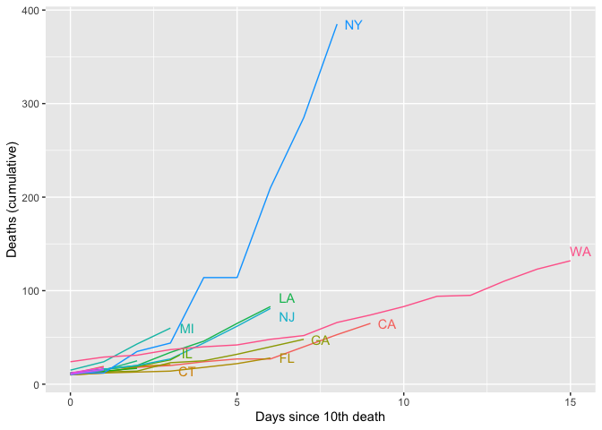
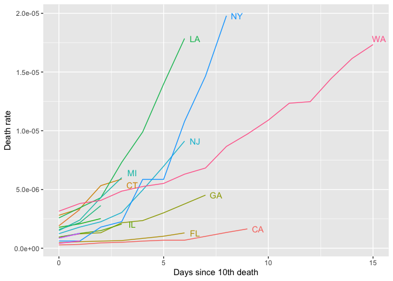

COVID-19 Deaths
================

``` r
library(tidyverse)
library(glue)
library(ggrepel)
```

### Cumulative Deaths by State

``` r
api <- "https://covidtracking.com/api/"

# Read in daily state-level data
states <- read_csv(glue(api, "states/daily.csv")) %>%
  mutate(date = as.Date(as.character(date), format = "%Y%m%d"))

# Calculate days since 10th death for each state
death10 <- states %>%
  filter(death >= 10) %>%
  group_by(state) %>%
  mutate(first = min(date)) %>%
  ungroup %>%
  mutate(since = as.integer(date - first))

ggplot(death10, aes(x = since, y = death, colour = state)) +
  geom_line() +
  geom_text_repel(
    data = filter(death10, date == max(date), since > 2),
    aes(label = state, color = state), 
    nudge_x = 0.5) +
  theme(legend.position = "none") +
  xlab("Days since 10th death") +
  ylab("Deaths (cumulative)")
```

<!-- -->

### Death Rate by State

``` r
# Get table of state names & abbreviations
abbrevUrl <- "https://worldpopulationreview.com/static/states/abbr-name.csv"
abbrev <- read_csv(abbrevUrl, col_names = c("abbrev", "name"))

# Get state populations (2019) from US Census Bureau
statePopUrl <- "http://www2.census.gov/programs-surveys/popest/datasets/2010-2019/national/totals/nst-est2019-alldata.csv"
statePop <- read_csv(statePopUrl) %>%
  select(state_name = NAME, pop = POPESTIMATE2019) %>%
  left_join(abbrev, by = c("state_name" = "name"))

# Merge state populations with COVID tracking data
death10pop <- death10 %>%
  left_join(statePop, by = c("state" = "abbrev")) %>%
  mutate(rate = death / pop)

ggplot(death10pop, aes(x = since, y = rate, colour = state)) +
  geom_line() +
  geom_text_repel(
    data = filter(death10pop, date == max(date), since > 2),
    aes(label = state, color = state), 
    nudge_x = 0.5) +
  theme(legend.position = "none") +
  xlab("Days since 10th death") +
  ylab("Death rate")
```

<!-- -->
